# Phase8 功能说明书（Web 端全链路）

## 1. 这份说明书的范围

这份文档只解释当前 phase8 Web 主链路，不介绍旧 Qt UI。

阅读目标有两个：

- 让第一次接手这个项目的人，能按“功能模块”理解系统，而不是先被节点名淹没
- 让调试时能快速知道“这一段问题应该看哪里”

当前主链路的总入口是：

- `ros2_ws/src/tactile_bringup/launch/phase8_web_ui.launch.py`

## 2. 一张图看完整链路

```mermaid
flowchart LR
    A["Web UI<br/>Control / Vision / Tactile / Logs"] --> B["tactile_web_gateway<br/>FastAPI + WebSocket"]
    B --> C["qwen_semantic_node<br/>任务语义结构化"]
    C --> D["detector_seg_node<br/>开放词汇分割 + ROI 跟踪"]
    D --> E["cloud_filter_node<br/>2D 到 3D 反投影 + 点云清洗"]
    E --> F["primitive_fit_node<br/>几何拟合与形状补全"]
    F --> G["grasp_input_cloud_node<br/>抓取输入云融合/冻结"]
    G --> H["grasp_backend_node<br/>GraspGen / GG-CNN / Contact-GraspNet"]
    H --> I["task_executive_node + search_target_skill_node<br/>搜索/锁定/执行编排"]
    I --> J["sim_pick_task_node<br/>pregrasp/grasp MoveIt 规划与执行"]
    J --> K["arm_control_node / arm_driver_node"]
    K --> L["Gazebo / 真实机械臂"]
    M["tactile_sensor_node<br/>触觉与健康状态"] --> B
    K --> B
```

## 3. 先看整体模块划分

| 功能模块 | 主要作用 | 关键实现 |
| --- | --- | --- |
| Web 交互模块 | 给操作者一个统一入口，负责对话、执行按钮、视觉监看、触觉与日志显示 | `tactile_web_gateway` + `tactile_web_bridge/frontend` |
| 多模态语义模块 | 把自然语言任务变成结构化抓取意图 | `qwen_semantic_node` |
| ROI/目标锁定模块 | 把“要抓哪个目标”变成 2D 检测实例和跟踪对象 | `detector_seg_node` |
| 2D 到 3D 点云模块 | 用深度图和相机内参把目标区域变成世界坐标系点云 | `cloud_filter_node` |
| 几何拟合与补全模块 | 把不完整点云补成更稳定的几何体表示 | `primitive_fit_node` + `grasp_input_cloud_node` |
| 抓取策略模块 | 生成抓取候选、输出接触点、抓取姿态和 pregrasp 姿态 | `grasp_backend_node` |
| 执行编排模块 | 管理搜索、目标锁定、执行、回家位与恢复 | `task_executive_node` + `search_target_skill_node` + `sim_pick_task_node` |
| 触觉与健康模块 | 发布触觉阵列、系统健康和机械臂状态 | `tactile_sensor_node` + `arm_control_node` |

下面按这个顺序展开。

## 4. Web 交互模块

### 4.1 它是什么

当前 Web 端由两部分组成：

- 后端：`tactile_web_gateway`
  - FastAPI + WebSocket
  - 负责把 ROS 2 话题、服务、Action 包装成 Web API
- 前端：`tactile_web_bridge/frontend`
  - React + Vite
  - 负责状态展示、对话输入和操作按钮

### 4.2 当前四个页面分别干什么

#### Control

这是当前真正的“任务控制页”，不是旧 UI 里的单独 task 页面。

主要功能：

- 多轮对话输入
- `Review / Auto` 两种模式切换
- 中英文回复切换
- 查看和修改结构化任务草稿
- 执行 `Execute`
- 重新规划 `Re-plan`
- 返回默认关节位 `Return Home`
- 场景重置 `Reset Scene`
- 打开调试视图 `Open Debug`

其中：

- `Review` 模式只更新任务，不自动执行
- `Auto` 模式会在语义足够明确且目标锁定后自动执行

#### Vision

Vision 页负责“看目标选得对不对”，不是负责控制执行。

主要功能：

- 显示 RGB / Detection Overlay / Grasp Overlay 三类图像流
- 显示 top-k 候选实例
- 点击某个候选后，立即把它提交为当前目标 override
- 展示当前目标标签、置信度、图像尺寸、候选摘要

说明：

- `Detection Overlay` 本质上是在 RGB 上画后端候选框和选择框
- `Grasp Overlay` 当前接的是 GG-CNN shadow 叠加图；如果 shadow 没启动，这一栏可能为空

#### Tactile

Tactile 页当前主要是“监视页”，还不是闭环触觉抓取控制页。

主要功能：

- 税元热力图
- 力曲线 sparkline
- 最新序列号、更新时间、frame id
- 机械臂/系统健康信息的展示入口

#### Logs

Logs 页负责“你现在走到哪一步了”。

主要功能：

- 任务 stepper
- 后端事件流
- 当前前端会话事件
- 日志清空和导出

### 4.3 Web 端到底用了什么 AI

当前 Web 交互里，至少有三层 AI 在工作：

| AI 能力 | 当前默认实现 | 用来做什么 |
| --- | --- | --- |
| 多轮对话控制 | OpenAI-compatible endpoint，默认模型名 `Qwen/Qwen2.5-VL-3B-Instruct-AWQ` | 理解操作者意图、维持会话状态、决定是更新任务还是执行 |
| 任务语义结构化 | `qwen_semantic_node`，默认同样走 Qwen VL | 产出结构化 `SemanticTask` |
| 视觉语义增强 | `detector_seg_node` 内的 scene prompt 和 relabel 路径，也可走 Qwen/VLM | 帮开放词汇分割生成 prompt classes、给歧义候选重命名 |

### 4.4 你可以怎么和它对话

当前对话不是闲聊式聊天，而是“任务控制式多轮对话”。最有效的说法是：

- 直接给任务
  - `抓取蓝色圆柱体`
  - `pick the blue cylinder`
- 给实例约束
  - `抓右边那个蓝色圆柱`
  - `pick the leftmost red block`
- 给抓取限制
  - `只用平行夹爪抓取蓝色圆柱`
- 明确执行
  - `开始执行`
  - `execute now`
- 取消或澄清
  - `先不要执行`
  - `你现在选中了哪个目标`

建议操作：

- 先在 `Review` 模式下确认结构化任务对不对
- 再切 `Execute` 或 `Auto`

## 5. 多模态语义模块

### 5.1 这层解决什么问题

它解决的是：

- 用户一句自然语言到底要做什么
- 目标物是什么
- 是否有颜色、左右、实例、夹爪方式等约束

当前主要实现：

- `qwen_semantic_node`

输入：

- `/qwen/user_prompt`
- 可选的当前 RGB 图像

输出：

- `/qwen/semantic_task`
- `/qwen/semantic_result`

### 5.2 结构化之后系统拿到了什么

语义结果会被整理成 `SemanticTask`，里面典型包括：

- `task`
- `target_label`
- `target_hint`
- `constraints`
- `excluded_labels`
- `confidence`
- `need_human_confirm`

这一步的目标不是直接抓，而是给后面的检测、目标锁定和抓取规划提供“明确任务上下文”。

## 6. ROI/目标锁定模块

### 6.1 这层解决什么问题

这一层要回答：

- 当前画面里哪些东西像目标
- 哪个实例才是要抓的那个
- 它的 2D bbox、mask、track id 是什么

当前主要实现：

- `detector_seg_node`

### 6.2 当前默认检测策略

从当前 phase8 参数看，默认主检测路径是：

- backend: `yoloe_local`
- 也就是本地 Ultralytics YOLOE 开放词汇分割

它不是单纯“全类别检测”，而是语义驱动的开放词汇检测：

- `qwen_semantic_node` 先给出目标提示
- `detector_seg_node` 会把目标提示扩展成 `prompt_classes`
- 如有必要，还会用场景 prompt 或 relabel VLM 来增强类别表达

### 6.3 这层最重要的设计点

#### 语义驱动的开放词汇提示

例如“蓝色圆柱体”不会只被看作一句中文，而会被扩展成类似：

- `blue cylinder`
- `cylinder`
- `container`

这样 YOLOE 才能更稳定地命中。

#### ROI 加速

当前检测不是每一帧都全图重跑。

它会：

- 先全图找候选
- 在目标实例相对稳定后，优先围绕历史 bbox 做 ROI 推理
- 定期回到全图刷新，避免越跟越偏

这就是当前“ROI/目标实例锁定”最核心的逻辑。

#### 语义与视觉联合排序

候选不是只按 detector 分数选。

当前代码会融合：

- detector 自身置信度
- 语义匹配程度
- 跟踪稳定度
- 可选的 VLM relabel 结果

所以一个框看起来有，但没被真正选中，不一定是 detector 没找到，而可能是排序没通过。

### 6.4 这一层的主要输出

最关键的消息是 `DetectionResult`，里面包含：

- `accepted`
- `candidate_visible`
- `candidate_complete`
- `target_label`
- `confidence`
- `bbox`
- `point_px`
- `mask`

也就是说，这一层既给 2D 框，也给像素级 mask。

## 7. 2D 到 3D 点云模块

### 7.1 这层解决什么问题

二维检测框和 mask 还不能直接抓，必须把它们变成世界坐标系中的目标点云和目标位姿。

当前主要实现：

- `cloud_filter_node`

### 7.2 它具体做了什么

可以把它理解成 8 步：

1. 读取最新 `DetectionResult`
2. 读取对齐深度图和相机内参
3. 用 bbox 或 mask 选出目标区域
4. 必要时复用历史 mask，并把 mask 投影到新的 bbox
5. 从目标区域里找 anchor pixel 和连通区域
6. 把目标区域从深度图反投影成点云
7. 变换到 `world` 坐标系
8. 做滤波、平面剔除、聚类和稳定性判断

### 7.3 你关心的几个关键词分别对应什么

#### 二维显示

二维层的主要展示入口在 Web `Vision` 页：

- 原始 RGB
- detection overlay
- grasp overlay

这部分方便确认“目标到底框没框对”。

#### 反投影

`cloud_filter_node` 使用：

- 深度图
- 相机内参
- 目标 bbox / mask

把像素区域变成相机坐标系点云，再通过 TF 变到世界坐标系。

#### 点云滤波

当前代码里主要做这些清理：

- 深度范围裁剪
- voxel downsample
- statistical outlier filter
- dominant plane removal
- cluster selection

这一步的目标不是做漂亮点云，而是做“可稳定抓取的目标云”。

#### 目标锁定

`cloud_filter_node` 还维护了两层状态：

- soft lock
- hard lock

也就是说，“看到了候选”不等于“目标已经稳定锁定”。  
只有锁定稳定了，后面的执行链才更可靠。

### 7.4 这层的关键输出

- `/perception/target_cloud`
- `/perception/target_cloud_markers`
- `/sim/perception/target_pose`
- `/perception/target_pose_camera`
- `/sim/perception/target_locked`

## 8. 几何拟合与点云补全模块

### 8.1 为什么还要再做一层几何拟合

真实场景里，目标通常只看到一部分。

如果直接把残缺点云扔给抓取后端，会有两个问题：

- 候选接触点不稳定
- 对称物体尤其容易因为遮挡导致姿态漂移

所以系统中间专门加了一层“几何稳定化”。

### 8.2 `primitive_fit_node` 在做什么

`primitive_fit_node` 会根据目标语义标签选择拟合策略，例如：

- cylinder
- box
- sphere
- hemisphere
- frustum
- axis profile

它不是只算一个中心点，而是尽量恢复更完整的几何体表面，并且利用短时历史做稳定化。

对你最常见的蓝色圆柱，这一层尤其重要，因为：

- 圆柱是典型的部分观测物体
- 直接原始点云往往只看到正面一条弧面
- 拟合后可以恢复更稳定的轴向、半径和高度

### 8.3 `grasp_input_cloud_node` 在做什么

这一层不是简单转发，而是在做“给抓取后端的最终输入准备”。

主要工作：

- 比较原始目标云和拟合云的一致性
- 给不同策略算置信度
- 从拟合云里挑选可以补全的点
- 保持上一帧稳定结果
- 在条件满足时冻结输出，避免执行时输入云抖动

输出是：

- `/perception/target_cloud_for_graspgen`
- `/perception/target_cloud_for_graspgen_debug`

如果你要理解“点云特征匹配、补全、冻结”的功能，这一层就是核心。

## 9. 抓取策略模块

### 9.1 这层解决什么问题

点云准备好了以后，系统还需要回答：

- 从哪里夹
- 夹爪怎么靠近
- 预抓取位姿是什么
- 哪个候选最值得先试

当前统一入口是：

- `grasp_backend_node`

### 9.2 当前支持的几种抓取后端

| 后端 | 当前用途 |
| --- | --- |
| `graspgen_zmq` | 当前主路径，phase8 默认配置 |
| `ggcnn_local` | 本地 GG-CNN，当前更多作为 shadow 可视化/对照 |
| `contact_graspnet_http` | 预留的另一类候选生成路径 |

### 9.3 当前主路径：GraspGen

当前 phase8 参数里，`grasp_backend_node` 默认配置为：

- backend: `graspgen_zmq`
- host: `127.0.0.1`
- port: `5556`
- repo: `/home/whispers/GraspGen`

它拿到的是 `target_cloud_for_graspgen`，输出的是 `GraspProposalArray`。  
每个候选里会包含：

- `contact_point_1`
- `contact_point_2`
- `grasp_center`
- `approach_direction`
- `closing_direction`
- `grasp_pose`
- `pregrasp_pose`
- `grasp_width_m`
- `confidence_score`
- `semantic_score`

这说明当前系统里的“抓取策略”并不只是一个分数，而是一整套几何抓取描述。

### 9.4 GG-CNN 在当前系统里是什么角色

从当前 launch 和 gateway 配置看，GG-CNN 更像：

- 一个 shadow/backend 对照工具
- 一个抓取叠加图来源
- 一个帮助看 grasp heatmap 的调试支路

所以你在 Web `Vision` 页里看到的 grasp overlay，并不代表当前主执行一定来自 GG-CNN。

### 9.5 `graspgen_topk_bridge_node` 是做什么的

这个节点的用途更偏可视化：

- 从 GraspGen 取 top-k 抓取几何
- 生成点云/接触点可视化
- 方便在 RViz 里看候选抓取分布

它不是主执行节点，而是一个理解和调试工具。

## 10. 执行编排模块

### 10.1 这层有哪些角色

当前执行编排主要由三层组成：

| 组件 | 作用 |
| --- | --- |
| `search_target_skill_node` | 把“搜索并锁定目标”包装成一个 skill/action |
| `task_executive_node` | 管理任务生命周期：搜索、等待锁定、触发执行、状态发布 |
| `sim_pick_task_node` | 真正做 MoveIt 的 pregrasp/grasp 规划、执行、return home、reset session |

### 10.2 一次执行大致会经过什么阶段

1. 接收到结构化任务
2. 如有需要，先做 search sweep
3. 等目标锁定
4. 获取外部抓取候选
5. 做 external candidate screening
6. 规划到 pregrasp
7. 再规划到 grasp / 执行闭合与搬运
8. 发布状态到 Web 与日志页

### 10.3 为什么 pregrasp 这么关键

很多“视觉明明看到了，但抓不起来”的问题，真正卡点都在这里：

- 候选抓取几何本身不差
- IK 可能也能过
- 但 MoveIt 从当前姿态到 pregrasp 姿态的路径不一定能在当前约束下规划出来

所以：

- “有抓取候选”不等于“可执行”
- “有 grasp pose”也不等于“pregrasp plan 一定成功”

### 10.4 当前配置里最影响执行行为的几个点

从 phase8 当前参数看，执行链里比较关键的是：

- 优先使用 external grasp candidates
- 当前要求 external candidates 成功后才继续主路径
- pregrasp screening 时间预算比较紧
- `Reset Scene` 后会自动 `Return Home`

这也是为什么现在系统调试时，经常会看到“视觉没问题，但卡在 pregrasp”。

## 11. 触觉与健康模块

### 11.1 触觉模块现在到哪一步了

当前触觉模块已经接进了 Web 端，但定位主要是：

- 触觉原始阵列显示
- 力分量显示
- 系统健康显示

还没有完全演化成“基于触觉反馈主动修正抓取策略”的闭环控制器。

### 11.2 `tactile_sensor_node` 在做什么

它会发布：

- `/tactile/raw`
- `/system/health`

并且支持两种来源：

- 真实传感器
- simulation fallback

实现上它仍会复用 legacy hardware interface，这也是为什么这部分你会感觉“已经接上了，但还没完全重构完”。

### 11.3 `arm_control_node` 在做什么

`arm_control_node` 是控制层安全代理，不建议 Web 端直接越过它调底层驱动。

它负责：

- 转发 enable/home/move joints 等控制请求
- 监视 `ArmState`
- 监视 `SystemHealth`
- 在紧急状态下做控制阻断

所以 Web 端点按钮时，真正走的是 control layer，不是直接敲硬件驱动。

## 12. 按功能调试时该看哪里

| 你在怀疑什么 | 先看哪里 |
| --- | --- |
| 语义理解不对 | `Control` 页对话历史，`/qwen/semantic_task` |
| 检测框不对 | `Vision` 页 detection overlay，`/perception/detection_result` |
| 目标明明框到了但没有 3D 位姿 | `cloud_filter_node` debug，`/perception/target_cloud_debug`，`/sim/perception/target_pose` |
| 点云有了但抓取候选为空 | `grasp_input_cloud_node` debug，`/perception/target_cloud_for_graspgen_debug`，`/grasp/candidate_grasp_proposals` |
| 抓取候选有了但不执行 | `Logs` 页，`/task/execution_status`，`sim_pick_task_node` 日志 |
| 场景 reset 后状态不干净 | `Reset Scene` 路径、`Return Home` 路径、`/sim/world/reset` 相关服务 |
| 触觉页没有数据 | `/tactile/raw`，`/system/health`，`tactile_sensor_node` |

## 13. 推荐的实际使用顺序

1. 打开 `Control` 页，先用 `Review` 模式输入任务。
2. 看结构化结果是不是你想要的目标和约束。
3. 到 `Vision` 页确认当前锁定实例。
4. 如有必要，点击候选实例做 override。
5. 回到 `Control` 页执行。
6. 抓取结束后优先 `Reset Scene`，让系统自动回到初始位姿。

## 14. 当前值得记住的几个边界

- 这套说明书不覆盖旧 Qt UI。
- 当前 Web 标签页是 `Control / Vision / Tactile / Logs`，不是单独的 `Task` 页。
- `Control` 页才是任务控制主入口。
- `Tactile` 页目前以遥测和状态展示为主，不是完整闭环触觉策略页。
- Web 里的急停目前仍是显式占位，不代表已经接了完整急停控制通路。

## 15. 如果你只想快速记一句话

当前系统不是“几个孤立节点拼起来”，而是一条功能链：

`Web 对话定义任务 -> 语义驱动视觉锁定目标 -> 点云把目标变成可抓的 3D 表示 -> 抓取后端给出 pregrasp/grasp 候选 -> MoveIt 判断它能不能真的执行 -> Web 端统一展示和复位。`
